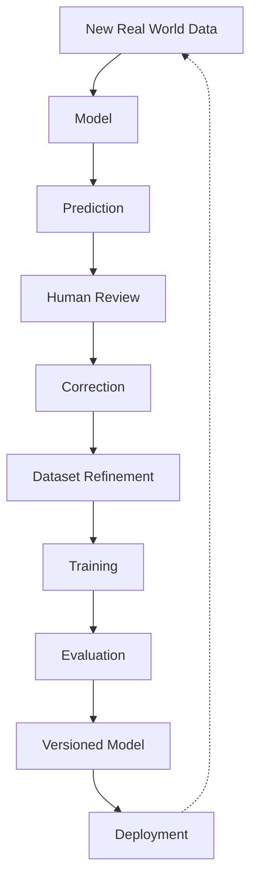
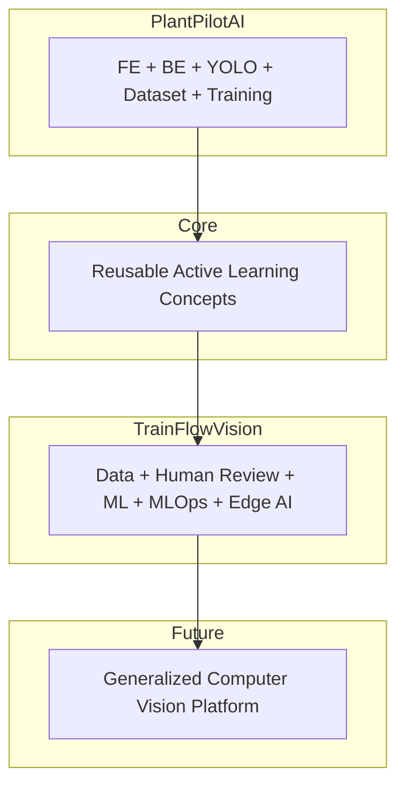

# PlantPilotAI-Fullstack

An early full-stack active learning computer vision platform built around YOLOv8, bridging dataset management, human review, and model refinement.

> **⚠️ Project Evolution Notice**  
> PlantPilotAI-Fullstack is the original full-stack active learning computer vision platform that became one of the architectural foundations for **TrainFlowVision**. This repository is intentionally preserved as a reference implementation of the earlier YOLO-focused system. Active research and development have moved into TrainFlowVision, where the architecture is being generalized beyond one dataset, one domain, and one model family.
> 
> **TrainFlowVision Public Showcase:**  
> [https://github.com/rathoddhruv/TrainFlowVision-Showcase](https://github.com/rathoddhruv/TrainFlowVision-Showcase)

## 📖 What PlantPilotAI Is

PlantPilotAI began as a practical, end-to-end experiment connecting a frontend Angular management interface, a FastAPI backend, and an Ultralytics YOLOv8 machine learning pipeline. It is not just a model script; it is a complete active learning loop where images are uploaded, predictions are rendered, human experts correct the labels, and the refined dataset triggers automated model retraining.

## 🎯 Why The Project Was Built

The major goal of this project was not simply plant detection, but exploring the engineering required to build a feedback loop around an ML model. Production AI is much more than running `model.predict()`. A useful vision system also needs:
- Dataset management
- Human feedback and annotation interfaces
- Training orchestration and hardware acceleration
- Model history, evaluation, and reproducibility
- Version management and rollback capabilities
- Deployment workflows and continuous refinement

## ✨ Core Capabilities

- **Drag & Drop Upload**: Intake ZIP exports from tools like Label Studio.
- **Real-time Training**: Orchestrated PyTorch/YOLOv8 training with GPU acceleration.
- **Live Logs**: Real-time training metrics streaming directly to the UI.
- **Model History & Rollback**: Track run history and safely rollback to prior model states.
- **Human-in-the-Loop Review**: Render detections, allow users to adjust classes or bounding boxes, and curate trusted datasets.

## 🏗️ System Architecture

PlantPilotAI is divided into three primary layers, integrated to form a continuous active learning loop:

### Active Learning Lifecycle

TrainFlowVision continues the broader engineering loop pioneered here:



### Frontend (FE) Architecture
- **Framework**: Angular 17 (Standalone), TypeScript, SCSS.
- **Role**: Provides the management, training, monitoring, and interactive human-review UI for verifying model inferences.

### Backend (BE) Architecture
- **Framework**: FastAPI (Python 3.11).
- **Role**: Manages file uploads, datasets, training orchestration, live WebSocket logs, model management, and communication between the UI and ML pipeline.

### Machine Learning (ML) Architecture
- **Framework**: PyTorch, Ultralytics YOLOv8.
- **Role**: Handles raw inference, model weight tracking, dataset refinement, and continuous retraining iterations utilizing NVIDIA CUDA hardware acceleration.

### Human-in-the-Loop Workflow

At the core of PlantPilotAI is the human review interface. When predictions are made, they are not blindly trusted. Users review the results, correct difficult examples, and refine the dataset. Only verified annotations are fed back into the dataset for the next retraining and model iteration cycle.

### Model Lifecycle & History

The system tracks model evolution through dataset intake -> training -> inference -> human review -> correction -> refined dataset -> retraining -> model history -> rollback or promotion. Users can view the dashboard, compare run histories, and actively rollback the live model to a previous, more stable state if necessary.

## 🚀 From PlantPilotAI to TrainFlowVision

The concepts pioneered in PlantPilotAI proved that closing the loop between inference and human review is critical for AI performance. However, PlantPilotAI was heavily coupled to plant detection and the YOLOv8 model architecture. 

**TrainFlowVision** is the evolution of these concepts. While PlantPilotAI explored *"Can a complete active learning application be built around a YOLO-based computer vision model?"*, TrainFlowVision expands that question into: *"Can the data collection, human feedback, model training, evaluation, model versioning, deployment, and continuous learning lifecycle become reusable enough to support different computer vision domains, tasks, runtimes, edge devices, and eventually different ML architectures?"*



### PlantPilotAI vs TrainFlowVision Comparison

| Feature/Concept | PlantPilotAI (Implemented) | TrainFlowVision (Evolved / Direction) |
|---|---|---|
| **Domain** | Plant-focused use case | Domain-independent platform |
| **Model Coupling** | YOLOv8-centered architecture | Pluggable model backends |
| **Task Geometries** | Object Detection | Detection, Segmentation, Rotated Bounding Boxes (where implemented) |
| **Data Intake** | ZIP / Static Images | Intelligent Image & Video intake, representative frame selection, duplicate reduction |
| **MLOps Lineage** | Basic run history & rollback | Stronger experiment & neural history, automated evaluation, controlled promotion |
| **Deployment** | Local PyTorch inference | PyTorch, ONNX export, TensorRT optimized, NVIDIA Jetson Edge deployment |
| **Robotics & Simulation**| None | Simulation driven data collection (PX4, Gazebo), drone vision experimentation |

### Model-Agnostic Direction

Technical honesty is extremely important: TrainFlowVision currently leverages robust YOLO-based workflows, but its *architectural direction* is designed to become model-agnostic. The new architecture is moving toward pluggable model backends to generalize beyond a YOLO-only workflow. Future model adapters can support additional detector, segmentation, transformer-based, or multimodal architectures. **These future adapters are planned architectural capabilities, not completed features.**

## 📌 Current Repository Status

**PlantPilotAI-Fullstack is currently in reference or maintenance mode.** 

Major new research, generalized active learning architecture, MLOps, and edge AI development continue in TrainFlowVision. This repository remains extremely useful for understanding the original full-stack implementation and how the architecture evolved. 

## 🛠️ Tech Stack

- **Backend**: Python 3.11, FastAPI, PyTorch, Ultralytics YOLOv8
- **Frontend**: Angular 17 (Standalone), TypeScript, SCSS
- **Environment**: Windows / Linux / macOS (NVIDIA GPU with CUDA highly recommended)

## 💻 Running Locally

> **Note**: For comprehensive instructions, please refer to the [Quick Start Guide](QUICKSTART.md).

### Windows
Double-click `start_dev.bat` or run:
```bash
start_dev.bat
```

### Linux/Mac
```bash
chmod +x start_dev.sh
./start_dev.sh
```

### Access Points
- **Frontend**: `http://localhost:4200`
- **Backend API**: `http://localhost:8000`
- **API Docs**: `http://localhost:8000/docs`

## 📁 Repository Structure

- `/FE`: Angular 17 Frontend application.
- `/BE`: FastAPI Backend orchestration and REST endpoints.
- `/ML`: Machine Learning scripts, YOLO configurations, and dataset utilities.
- `/data`: Local data storage for datasets and runs.

## 🧠 Engineering Lessons and Impact

Building PlantPilotAI-Fullstack proved that a single engineer can build the entire lifecycle of an AI product—from the frontend UI to the GPU memory management. It highlighted the friction points of manual data curation and validated the necessity of a seamless `Data -> Model -> Prediction -> Human Review -> Correction -> Dataset Refinement -> Training` loop. These lessons are the bedrock of the TrainFlowVision project.

## 🔗 Related Project

- **[TrainFlowVision Public Showcase](https://github.com/rathoddhruv/TrainFlowVision-Showcase)** - Public architecture, portfolio showcase, screenshots, and documentation for the TrainFlowVision project.
